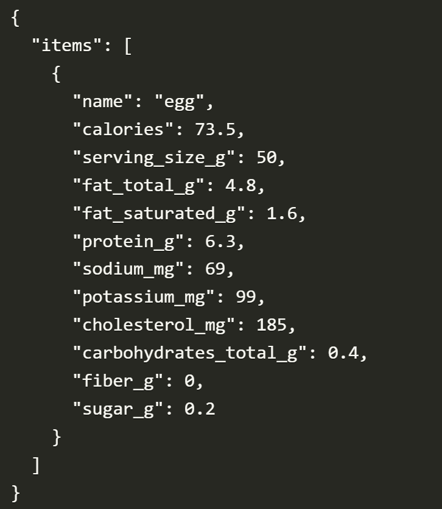
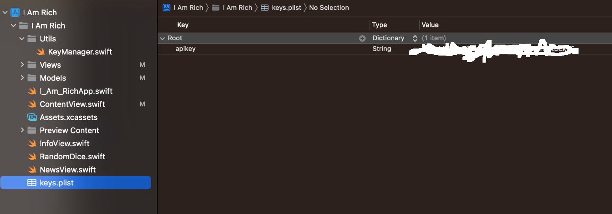
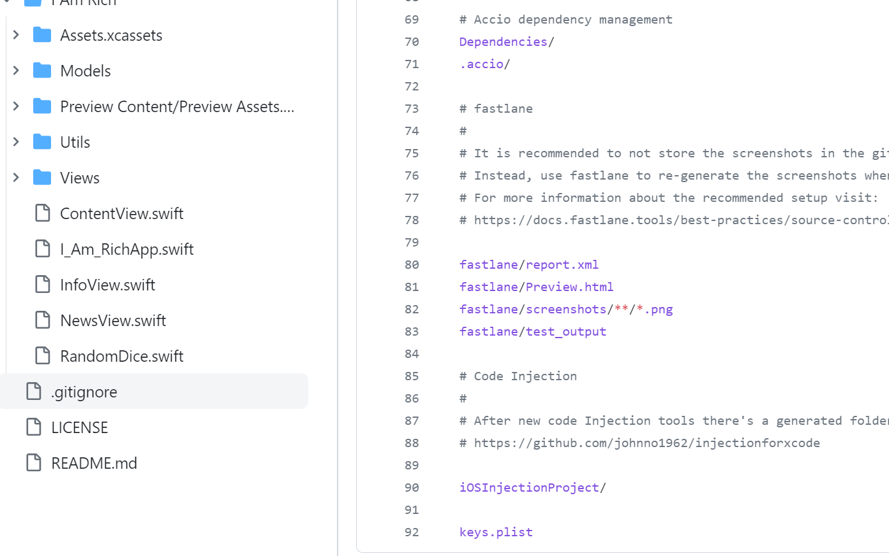
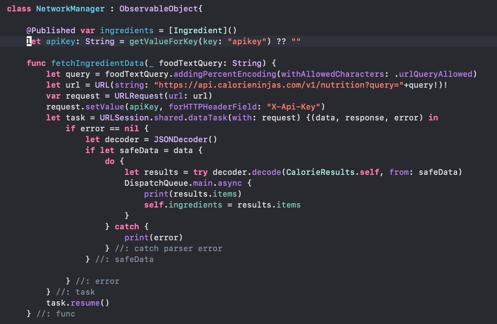
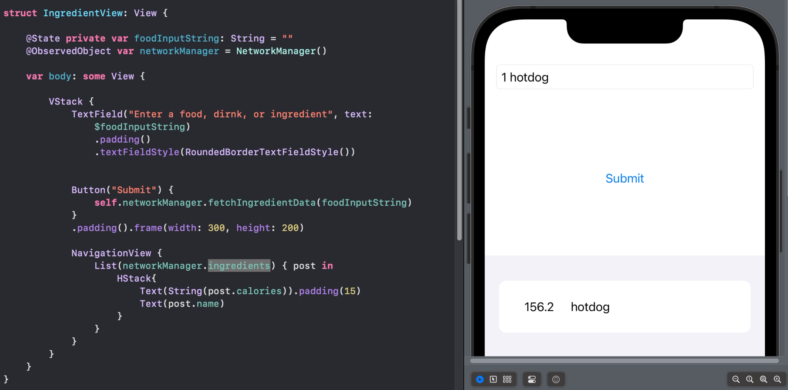
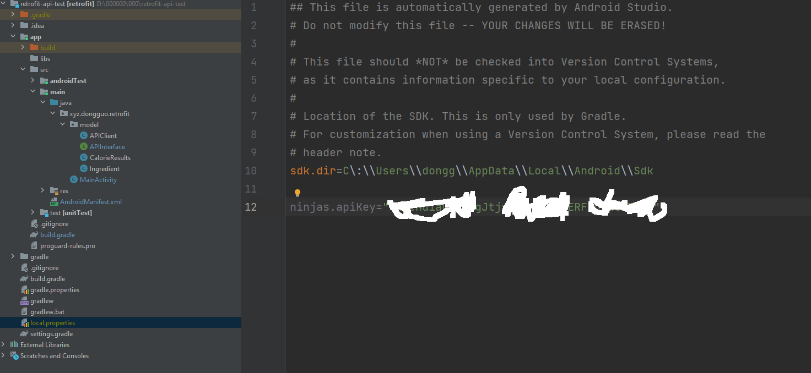
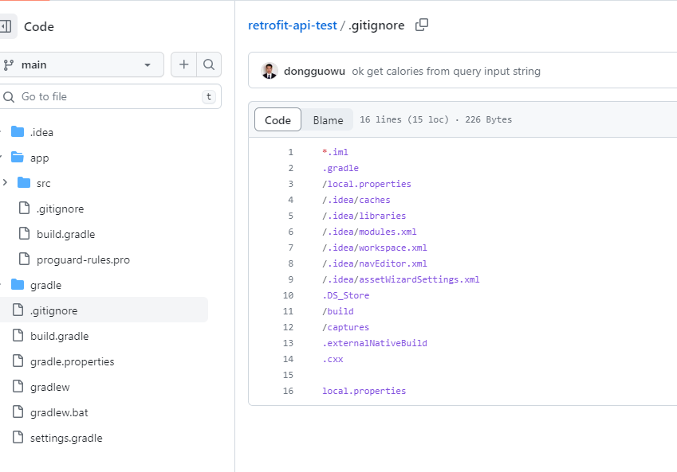
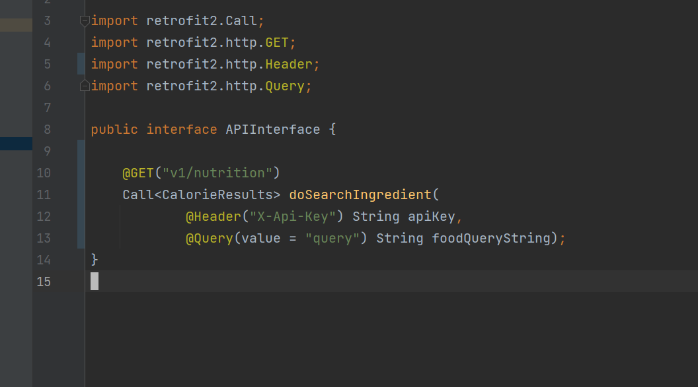
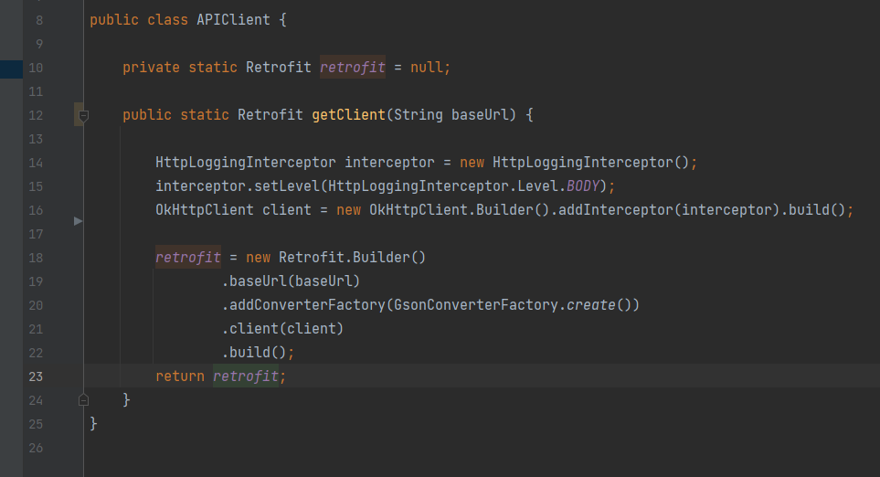
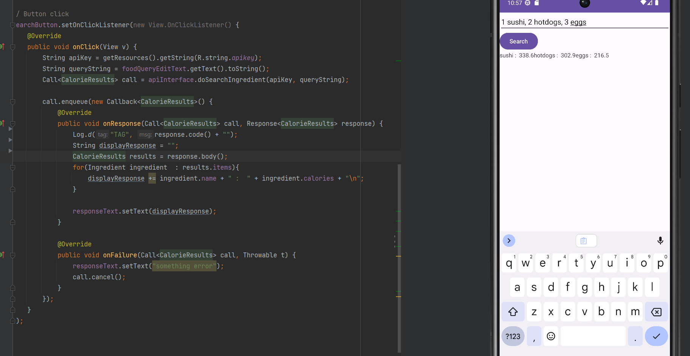

# How to use Calorie Ninjas API on Swift & Android

## Calorie Ninjas API

- get a detailed nutrition information including calories, protein from an input text query 
- free account limits
  - 10,000 API calls/month
  - No commercial use
- $8/month Plan
  - 100,000 API calls/month
  - Yes commercial use

## API Use Summary

- Store and retrieve api key securely
  > using environment variables or a configuration file outside the source code repository. Avoid hardcoding API keys directly in your code, as this can lead to security vulnerabilities if your code is exposed.
- Make Asynchronous Network Requests

  > Modern apps communicate with APIs asynchronously to ensure a smooth user experience.Asynchronous requests prevent your app from becoming unresponsive while waiting for a response from the API.

- Display response on UI

  > Parse the response data, typically in JSON format, to extract the necessary information.

- Handler error

  - Network Errors

    - No Internet connection
    - TimeOut

  - Authentication and Authorization Errors

    - Invalid API Key
    - Expired Token

  - Server-Side Errors

    - 10,000 API calls/month
    - Rate Limiting

  - Client-Side Errors
    - Validation Errors
    - Input Sanitization

- Encapsulating API-related logic in separate services or viewModels
  > to get a better code organization and maintainability. This separation of concerns can make your codebase more modular and easier to test.

## iOS swiftUI

- Store and retrieve api key securely

  - using configuration file, .plist

  

  - ignore secure key on git

  

- Make Asynchronous Network Requests

  - Use URLSession to make an async network request to the API. 

- Display response on UI

- Handle error And Tests

  > to create a robust and user-friendly application that gracefully handles errors in various scenarios

  ## Android

- Store and retrieve api key securely

  - use Android Studio generated local configuration, local.properties on root folder

  

  - no secure information exposed on GitHub

  

- Make Asynchronous Network Requests

  - Use [Retrofit](https://square.github.io/retrofit/)

    - Retrofit turns your HTTP API into a Java interface.

    

  

  

- Display response on UI

- Handle error And Tests
  > to create a robust and user-friendly application that gracefully handles errors in various scenarios
